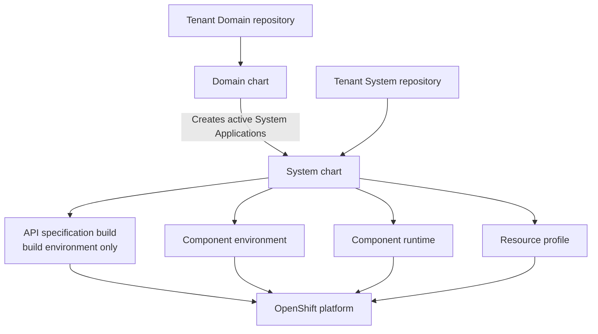

# Contract-First IDP developer charts

Reusable Helm charts that turn tenant Git state into OpenShift runtime resources.

All distributed charts in this initial coordinated baseline use chart version `1.0.0` and are
consumed from repository revision `v1.0.0`.

This repository is the platform implementation layer of Contract-First IDP. The companion
`software-templates` repository captures developer intent as small, reviewable files. These charts
discover those files through Argo CD ApplicationSets and reconcile namespaces, pipelines, registry
infrastructure, workloads, and managed Resources.

## Why this repository exists

Tenant Git says what a team wants, but it should not let every tenant redefine how the platform
builds software, accesses registries, grants cross-namespace permissions, or provisions managed
services. This repository provides that trusted interpretation in one platform-owned,
version-controlled implementation.

Keeping the charts separate from `software-templates` means:

- platform engineers can update runtime policy without regenerating every tenant workload
  repository;
- tenants can request supported capabilities without selecting arbitrary chart repositories or
  embedding infrastructure credentials;
- Argo CD can reconcile the same reviewed intent repeatedly and recover after transient failures;
- the template-to-chart interface can be validated as a contract;
- deployment behavior remains inspectable Helm output rather than hidden Backstage side effects.

The repository is successful when the same tenant and platform revisions render deterministic,
explainable cluster state and when platform changes can be evaluated before adoption by tenant
entrypoints.

This repository deliberately does **not**:

- collect developer input or create catalog entities and source repositories;
- mutate tenant Git or decide that a release should be promoted;
- create SCM organizations, teams, or source credentials;
- install OpenShift GitOps, Pipelines, Quay Bridge, Schema Registry, or Resource operators;
- serve as an unrestricted mechanism for tenants to run arbitrary charts.

Entity-producing repositories use `/catalog-info.yaml`; these charts consume the platform and
tenant values derived from that root catalog convention but do not publish catalog entities.

> **New to the charts?** Read the [architecture guide](docs/architecture.md), then validate your
> platform against the [requirements checklist](docs/platform-requirements.md).

## Architecture at a glance



The Domain chart runs once and creates discovery controllers for all ordered environments. Each System chart independently
discovers Component infrastructure, Component releases, and Resources; the build-environment
instance also discovers APIs. Leaf charts create the runtime objects. No chart mutates a tenant
repository.

## Why the charts are separate

Chart separation follows distinct ownership and reconciliation signals. This keeps a change in one
lifecycle from forcing unrelated resources to appear or rerun.

| Chart | Why it exists separately | Responsibility | Detailed guide |
| --- | --- | --- | --- |
| `charts/domain/system-discovery` | Keeps tenant-wide lifecycle policy above application concerns | Discover active Systems across all Domain environments | [`charts/domain/system-discovery/README.md`](charts/domain/system-discovery/README.md) |
| `charts/system/environment` | Centralizes shared namespace, project, discovery, and promotion policy | Create the System scope and leaf ApplicationSets | [`charts/system/environment/README.md`](charts/system/environment/README.md) |
| `charts/api/specification-build` | Gives contracts a publication lifecycle independent of workloads | Validate and publish OpenAPI contracts | [`charts/api/specification-build/README.md`](charts/api/specification-build/README.md) |
| `charts/component/environment` | Allows registry infrastructure to exist before a release is selected | Create the environment-local ImageStream | [`charts/component/environment/README.md`](charts/component/environment/README.md) |
| `charts/component/runtime` | Lets artifact selection drive runtime and promotion without owning registry provisioning | Reconcile runtime, build, webhook, and release-launcher resources | [`charts/component/runtime/README.md`](charts/component/runtime/README.md) |
| `charts/resource/postgresql` | Encapsulates one trusted implementation behind the generic Resource contract | Create a Crunchy `PostgresCluster` | [`charts/resource/postgresql/README.md`](charts/resource/postgresql/README.md) |

Charts are grouped by Backstage catalog entity kind. Component environment and runtime concerns are
separate because registry provisioning and release selection are independent lifecycle signals.
The canonical repository convention is `charts/<entity>/<responsibility>`; no compatibility chart
copies are maintained at older paths.

## Quick validation

The deterministic suite requires Node.js, npm, and Helm on `PATH`.

```bash
npm ci
npm test
```

The tests lint every chart, render representative build and promotion environments, parse the
resulting multi-document YAML, and assert platform contracts. They require neither a live cluster
nor the `software-templates` checkout.

Lint or render one chart during development:

```bash
helm lint charts/domain/system-discovery
helm template tenant-domain charts/domain/system-discovery \
  -f /path/to/merged-target-and-domain-entities.yaml
```

See [Development and testing](docs/development.md) for the full test matrix and cross-repository
compatibility checks.

## Reconciliation contracts

| Tenant Git signal | Chart behavior |
| --- | --- |
| `systems/<system>/environments/<environment>.yaml` | Attach a System to a Domain environment |
| `apis/<api>/values.yaml` | Create API publication resources in the build environment |
| `components/<component>/environments/<environment>.yaml` | Create Component registry infrastructure |
| `components/<component>/releases/<environment>.yaml` | Create the Component runtime and, outside build, its promotion launcher |
| `resources/*/*/environments/<environment>.yaml` | Provision a managed Resource |

File absence also carries meaning: a System is inactive, a Component repository can exist before
release, and target registry infrastructure can exist before an image arrives.

## Core operating rules

- The Domain defines environment names, order, build environment, and namespace suffixes. The
  platform target defines the router domain.
- The first ordered environment is the only build environment.
- Image promotion is adjacent and forward-only.
- Release materialization copies an existing `git-<sha>` build image to a human tag; source is not
  rebuilt for release or promotion.
- Tenant Git chooses desired state. Platform values choose trusted chart sources and infrastructure
  integration.
- One Domain Application owns the Domain AppProject; System build-environment Applications own
  their derived System projects.
- Registry credentials remain namespace-local; promotion reads a named source Secret through
  narrowly scoped RBAC and never copies the Secret.

The [architecture guide](docs/architecture.md) explains these rules and their data flow in detail.

## Platform prerequisites

At minimum, the target cluster needs:

- OpenShift GitOps with `Application` and `ApplicationSet` CRDs;
- a platform-generated per-Domain admission AppProject;
- OpenShift Pipelines with the cluster resolver enabled;
- `git-clone` and `buildah` Tasks in `openshift-pipelines`;
- the `skopeo-copy` Task in `openshift-pipelines`;
- the curated Java 21 `maven` Task in `tekton-tasks`;
- Quay Bridge with the expected namespace-local robot Secrets;
- a Schema Registry reachable without credentials from API Pipelines and generated Components, or
  a platform-customized authenticated Maven path;
- the Crunchy Postgres Operator when using the PostgreSQL Resource profile.

Exact configuration and verification commands are in
[Platform requirements](docs/platform-requirements.md).

## Operations

Use [Operations and troubleshooting](docs/operations.md) for:

- initial-build failures;
- API publication failures;
- Component release materialization;
- retrying promotion launchers and PipelineRuns;
- expected temporary `ImagePullBackOff`;
- Argo CD ownership and AppProject checks.

## Repository map

| Path | Purpose |
| --- | --- |
| [`charts/domain/system-discovery/`](charts/domain/system-discovery/) | Domain discovery and controller project |
| [`charts/system/environment/`](charts/system/environment/) | System discovery, namespace, project, build RBAC, and promotion engine |
| [`charts/api/specification-build/`](charts/api/specification-build/) | OpenAPI validation and publication |
| [`charts/component/environment/`](charts/component/environment/) | Environment-local ImageStream |
| [`charts/component/runtime/`](charts/component/runtime/) | Component build, release, promotion launcher, and runtime |
| [`charts/resource/postgresql/`](charts/resource/postgresql/) | PostgreSQL Resource implementation |
| [`test/`](test/) | Rendered contract tests and fixtures |

Every chart includes a `values.schema.json`. Tests intentionally use split platform/tenant SCM and
nonstandard lifecycle names to prevent hidden assumptions.

All deterministic checks use Jest and the singular `test/` tree:

```bash
npm ci
npm test
```

## Current limitations

- Tenant source repositories must be public for anonymous Tekton clone.
- Webhook signature verification is reserved but not implemented for the lab EventListeners.
- Component builds package with `-DskipTests`; run tests in a separate required check.
- Component release materialization can replace an existing human tag unless Quay or release
  policy prevents it.
- Quay Bridge robot ACLs are external to these charts and require operational validation.
- PostgreSQL is the only included Resource implementation.
- `build.sccClusterRoleName` remains a reserved value; leaf charts do not consume it directly.
- Multi-cluster environment placement is reserved through `spec.platformTarget`; environment-level
  target placement is not implemented.
