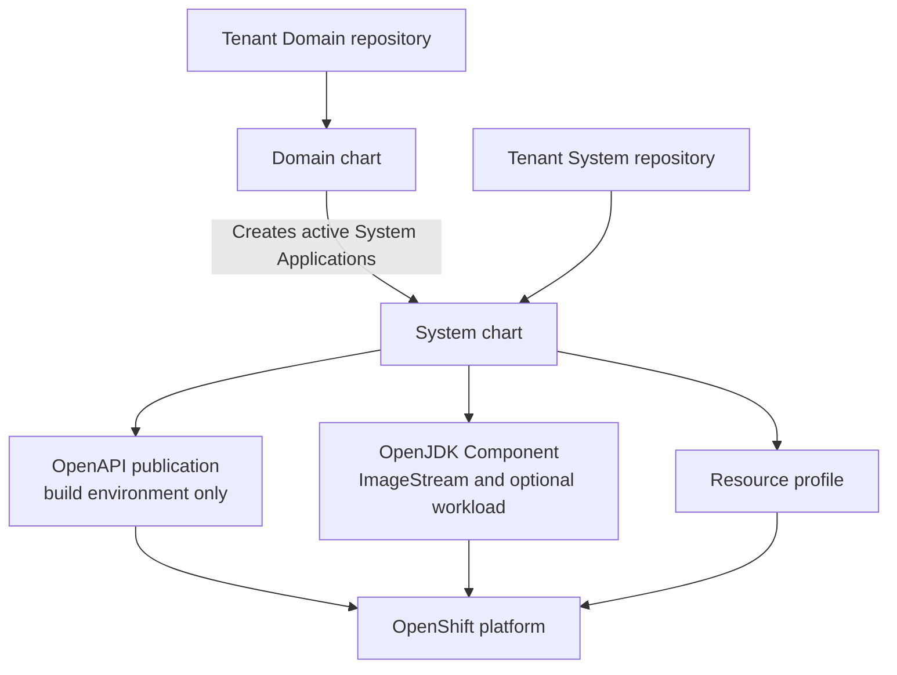

# Contract-First IDP Developer Charts

Turn small, reviewed tenant configuration files into predictable OpenShift resources.

These reusable Helm charts are the runtime layer of Contract-First IDP. Argo CD uses them to
discover tenant Git state and reconcile namespaces, pipelines, registry infrastructure, workloads,
and managed Resources. Developers describe what they need; platform engineers own how it runs.

## Start here

- **Learning the chart flow:** read the [architecture guide](docs/architecture.md).
- **Preparing a cluster:** work through the [platform requirements](docs/platform-requirements.md).
- **Testing a change:** begin with [quick validation](#quick-validation), then see
  [development and testing](docs/development.md).
- **Running the charts:** use the [operations guide](docs/operations.md).

If you want to install the complete workshop platform, start in `platform-components`. Tenant
developers normally interact with the golden paths from `software-templates` rather than using
these charts directly.

The contract between templates and charts is ordinary Git content. That separation lets platform
engineers evolve runtime policy without regenerating tenant repositories, and it keeps deployment
behavior visible as rendered Helm output.

## Quick validation

You need Node.js, npm, and Helm on `PATH`. GitHub Actions uses Helm `v3.17.3`.

```bash
helm version --short
make test
```

The direct test-package equivalent is:

```bash
npm ci --prefix test
npm test --prefix test
```

The tests lint every chart, render representative build and promotion environments, and verify the
resulting contracts. They need neither a live cluster nor a `software-templates` checkout.

To inspect one chart while working:

```bash
helm lint charts/domain/environment
helm template tenant-domain charts/domain/environment \
  -f /path/to/merged-target-and-domain-entities.yaml
```

All test tooling lives under `test/`; this repository itself is not an npm package. See
[Development and testing](docs/development.md) for the full test matrix.

## Architecture at a glance



The Domain chart creates discovery controllers for the tenant's ordered environments. Each System
chart then discovers APIs, Components, releases, and Resources for its environment. Leaf charts
create the runtime objects. No chart mutates a tenant repository.

All distributed charts in this coordinated release use chart version `1.0.0` and are consumed from
repository revision `v1.0.0`.

These charts do not collect developer input, create source repositories, install the platform
operators, or choose when a release should be promoted. Those responsibilities remain with
`software-templates`, `platform-components`, and tenant Git review.

## Why the charts are separate

Chart separation follows distinct ownership and reconciliation signals. This keeps a change in one
lifecycle from forcing unrelated resources to appear or rerun.

| Chart | Why it exists separately | Responsibility | Detailed guide |
| --- | --- | --- | --- |
| `charts/domain/environment` | Keeps tenant-wide lifecycle policy above application concerns | Discover active Systems across all Domain environments | [`charts/domain/environment/README.md`](charts/domain/environment/README.md) |
| `charts/system/environment` | Centralizes shared namespace, project, discovery, and promotion policy | Create the System scope and leaf ApplicationSets | [`charts/system/environment/README.md`](charts/system/environment/README.md) |
| `charts/api/openapi` | Gives OpenAPI contracts a publication lifecycle independent of workloads | Validate and publish OpenAPI contracts | [`charts/api/openapi/README.md`](charts/api/openapi/README.md) |
| `charts/component/openjdk` | Keeps one OpenJDK Component environment in one reconciliation boundary | Create its ImageStream and conditionally reconcile build, runtime, and promotion resources | [`charts/component/openjdk/README.md`](charts/component/openjdk/README.md) |
| `charts/resource/postgresql` | Encapsulates one trusted implementation behind the generic Resource contract | Create a Crunchy `PostgresCluster` | [`charts/resource/postgresql/README.md`](charts/resource/postgresql/README.md) |

Charts are grouped first by Backstage catalog entity kind, then by the current implementation or
lifecycle concern: `domain/environment`, `system/environment`, `api/openapi`,
`component/openjdk`, and `resource/postgresql`. The structure leaves room for additional concrete
profiles later without documenting or implementing hypothetical profiles now.

## Reconciliation contracts

| Tenant Git signal | Chart behavior |
| --- | --- |
| `systems/<system>/environments/<environment>.yaml` | Attach a System to a Domain environment |
| `apis/<api>/values.yaml` | Create API publication resources in the build environment |
| `components/<component>/environments/<environment>.yaml` | Create one Component Application and its ImageStream |
| Optional `components/<component>/releases/<environment>.yaml` | Select an image tag and add workload or promotion resources to that Application |
| `resources/*/*/environments/<environment>.yaml` | Provision a managed Resource |

File absence also carries meaning: a System is inactive, a Component repository can exist before
release, and target registry infrastructure can exist before an image arrives.

## Core operating rules

- The Domain defines environment names, order, build environment, and namespace suffixes. The
  platform target defines the router domain.
- The first ordered environment is the only build environment.
- Image promotion is adjacent and forward-only.
- Release materialization copies an existing `git-<sha>` build image to a human tag; source is not
  rebuilt for release or promotion.
- Tenant Git chooses desired state. Platform values choose trusted chart sources and infrastructure
  integration.
- One Domain Application owns the Domain AppProject; System build-environment Applications own
  their derived System projects.
- Registry credentials remain namespace-local; promotion reads a named source Secret through
  narrowly scoped RBAC and never copies the Secret.

The [architecture guide](docs/architecture.md) explains these rules and their data flow in detail.

## Platform prerequisites

At minimum, the target cluster needs:

- OpenShift GitOps with `Application` and `ApplicationSet` CRDs;
- a platform-generated per-Domain admission AppProject;
- OpenShift Pipelines with the cluster resolver enabled;
- `git-clone` and `buildah` Tasks in `openshift-pipelines`;
- the `skopeo-copy` Task in `openshift-pipelines`;
- the curated Java 21 `maven` Task in `tekton-tasks`;
- Quay Bridge with the expected namespace-local robot Secrets;
- a Schema Registry reachable without credentials from API Pipelines and generated Components, or
  a platform-customized authenticated Maven path;
- the Crunchy Postgres Operator when using the PostgreSQL Resource profile.

Exact configuration and verification commands are in
[Platform requirements](docs/platform-requirements.md).

## Operations

Use [Operations and troubleshooting](docs/operations.md) for:

- initial-build failures;
- API publication failures;
- Component release materialization;
- retrying promotion launchers and PipelineRuns;
- expected temporary `ImagePullBackOff`;
- Argo CD ownership and AppProject checks.

## Repository map

| Path | Purpose |
| --- | --- |
| [`charts/domain/environment/`](charts/domain/environment/) | Domain discovery and controller project |
| [`charts/system/environment/`](charts/system/environment/) | System discovery, namespace, project, build RBAC, and promotion engine |
| [`charts/api/openapi/`](charts/api/openapi/) | OpenAPI validation and publication |
| [`charts/component/openjdk/`](charts/component/openjdk/) | OpenJDK ImageStream, build, runtime, and promotion resources |
| [`charts/resource/postgresql/`](charts/resource/postgresql/) | PostgreSQL Resource implementation |
| [`test/`](test/) | Rendered contract tests and fixtures |

Every chart includes a `values.schema.json`. Tests intentionally use split platform/tenant SCM and
nonstandard lifecycle names to prevent hidden assumptions.

All deterministic checks use Jest and the singular `test/` tree:

```bash
make test
```

## Current limitations

- Tenant source repositories must be public for anonymous Tekton clone.
- Webhook signature verification is reserved but not implemented for the lab EventListeners.
- Component builds package with `-DskipTests`; run tests in a separate required check.
- Component release materialization can replace an existing human tag unless Quay or release
  policy prevents it.
- Quay Bridge robot ACLs are external to these charts and require operational validation.
- PostgreSQL is the only included Resource implementation.
- `build.sccClusterRoleName` remains a reserved value; leaf charts do not consume it directly.
- Multi-cluster environment placement is reserved through `spec.platformTarget`; environment-level
  target placement is not implemented.
