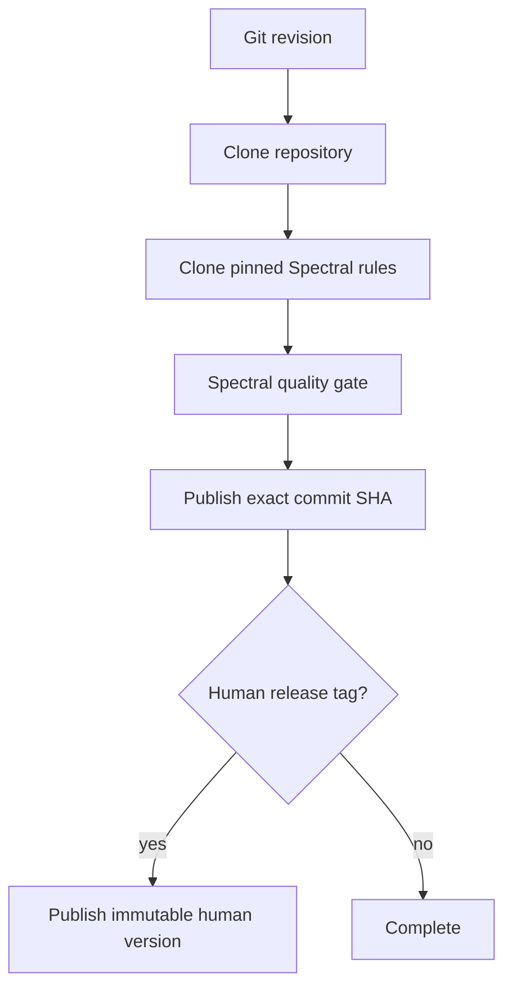

# OpenAPI chart

Validates one API repository and publishes its complete OpenAPI document to the platform Schema
Registry.

## Pipeline behavior



`spectral-quality-gate` is the sole contract validator. Its configured ruleset owns OpenAPI
structure, required metadata, operation identifiers, uniqueness, style, and governance. A failed
Spectral Task fails the PipelineRun, and neither Registry publication task can start.

The repository's Maven POM configures the official Apicurio Registry Maven plugin. Both publication
steps resolve the curated `tekton-tasks/maven` Task with Java 21. The Pipeline contains no custom
Registry REST client or downloaded CLI.

## Version rules

| Trigger | Git revision | Registry result |
| --- | --- | --- |
| Initial sync or main push | Exact commit | Idempotent SHA version through `FIND_OR_CREATE_VERSION` |
| Human tag such as `v2`, `v2.1.3`, or `v2.1.3-rc.1` | Exact tag and peeled commit | SHA version followed by immutable human version through `CREATE_VERSION` |
| Tag deletion or unsupported tag | None | Ignored |

OpenAPI `info.version` remains contract metadata and does not choose the Registry version.

## Reconciliation entry points

- A retained Argo CD Sync hook Job publishes the initial repository revision.
- A failed hook Job is removed so a later sync can retry.
- An EventListener handles later main pushes.
- A separate trigger handles supported release tags.

The tenant source repository is cloned anonymously. Webhook signature verification is reserved in
the values contract but is not implemented; public EventListener Routes are lab/development-only.

## Required inputs

| Value | Purpose |
| --- | --- |
| `systemName`, `groupId`, `apiName` | Registry and runtime identity |
| `repository`, `revision` | Public API source |
| `serviceAccountName` | ServiceAccount used by the PipelineRun |
| `schemaRegistry.apiUrl` | Publication endpoint |
| `spectralRules.{repositoryUrl,revision,path}` | Pinned platform quality rules |
| `webhook.signatureVerification` | Reserved future contract; currently inactive |

The chart does not mount Schema Registry credentials. The endpoint must accept the generated Maven
plugin requests without authentication, or the platform must supply a customized authenticated
Maven Task.

## Validate

```bash
helm lint charts/api/openapi
helm template example-api charts/api/openapi -f /path/to/api-values.yaml
```

See [Operations](../../../docs/operations.md#initial-api-publication) for failure checks and retry
behavior.
