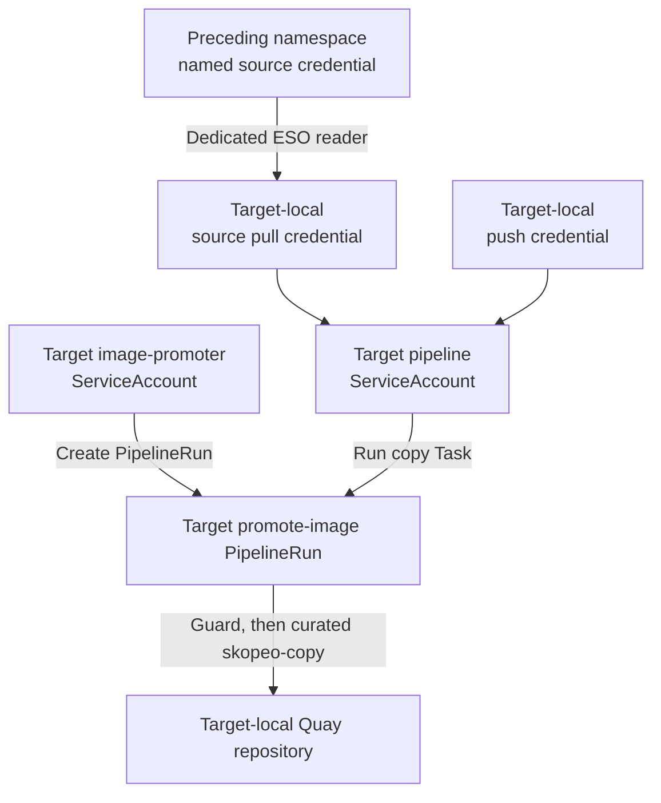

# System chart

Creates one active System environment. Every environment discovers its Components, releases, and
Resources; the build environment also discovers APIs.

## Discovery paths

| Pattern | Scope | Result |
| --- | --- | --- |
| `apis/*/values.yaml` | Build environment only | OpenAPI publication Applications |
| `components/*/environments/<environment>.yaml` | Selected environment | Container Component Applications |
| `resources/*/*/environments/<environment>.yaml` | Selected environment | Resource implementation Applications |

Each active Component environment has one Application. It loads base and environment values plus
an optional `components/<component>/releases/<environment>.yaml` file. The Container chart creates the
ImageStream immediately and waits for `image.tag` before creating workload resources.

## Responsibilities

The chart creates:

- the environment-specific System namespace;
- the System AppProject from the build environment only;
- one Component and one Resource ApplicationSet in every environment;
- the API ApplicationSet in the build environment;
- build RBAC in the Domain's build environment;
- adjacent image-promotion RBAC and Pipeline resources in later environments.

Resource declarations select a supported implementation path. The trusted repository and revision
come from `delivery.charts`, so tenant state cannot redirect Argo CD to another implementation.

## Required inputs

| Values | Purpose |
| --- | --- |
| `domainName`, `systemName`, `groupId`, `owner` | Catalog identity and ownership |
| `systemRepository` | Tenant desired-state source |
| `environment` and `environments` | Selected environment and full lifecycle |
| `delivery` | Argo CD namespace, AppProject, destination, and trusted charts |
| `registry` | Quay host, cluster ID, and credential names |
| `schemaRegistry.apiUrl` | API publication endpoint |
| `build` | Build environment, revision, and rollout policy; `sccClusterRoleName` is currently reserved |

## AppProject ownership

The build-environment System Application creates `tenant-<domain>-<system>` at sync wave 0. Every
System-owned ApplicationSet renders at wave 1 and assigns its leaf Applications to that project.
Non-build environments use the project without recreating it.

## Promotion security model



The first ordered environment has build RBAC and no incoming promotion Pipeline. Each later
environment owns its incoming reader, SecretStore, ExternalSecret, promoter, and Pipeline fixed to
the immediately preceding environment. It creates only a named-Secret Role and binding in that
already-active source namespace. A shared compact Task guards human-version digest compatibility,
while all copies resolve the curated `openshift-pipelines/skopeo-copy` Task. The `image-promoter`
ServiceAccount can submit the target-local PipelineRun but cannot read registry Secrets. The target
`pipeline` ServiceAccount references only local Secrets and has no cross-namespace Secret access.
RBAC grants no reverse, non-adjacent, or cross-namespace PipelineRun access.

Build and promotion registry credentials are declared under `ServiceAccount.secrets` for Tekton's
credential initializer. The charts do not manage `ServiceAccount.imagePullSecrets`; OpenShift owns
that generated field. This does not change the pod-level `imagePullSecrets` rendered by workload
charts for runtime image pulls.

## Validate

```bash
helm lint charts/system/environment
helm template tenant-system charts/system/environment -f /path/to/system-values.yaml
```

See [Architecture](../../../docs/architecture.md#image-promotion) and
[Operations](../../../docs/operations.md#promotion-pipeline-failures) for the full promotion model.
