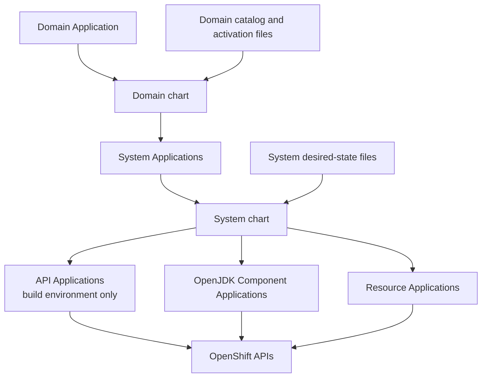
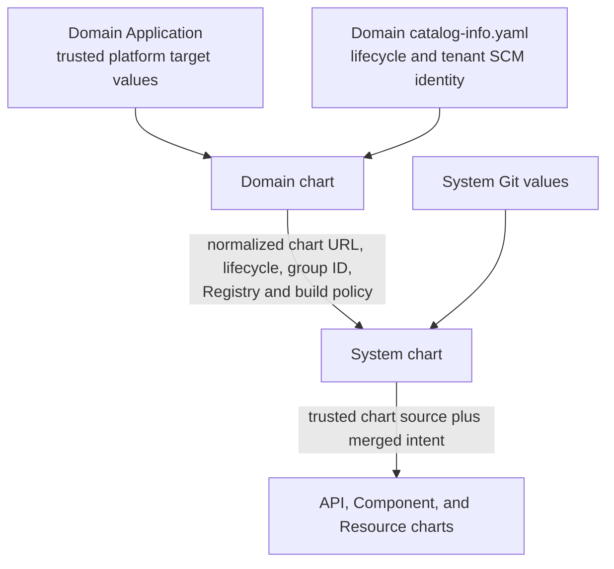
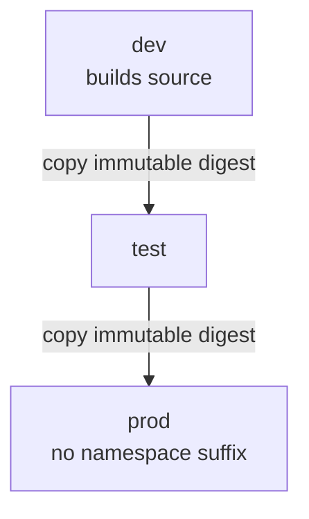
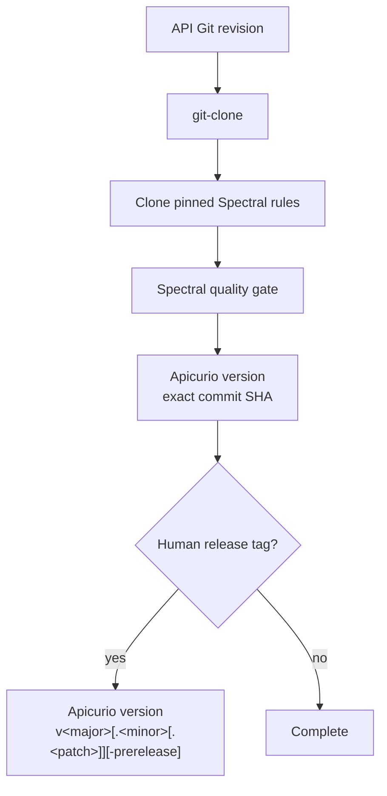
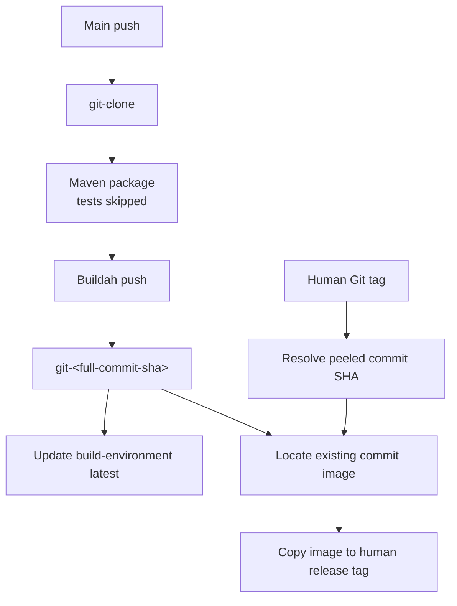
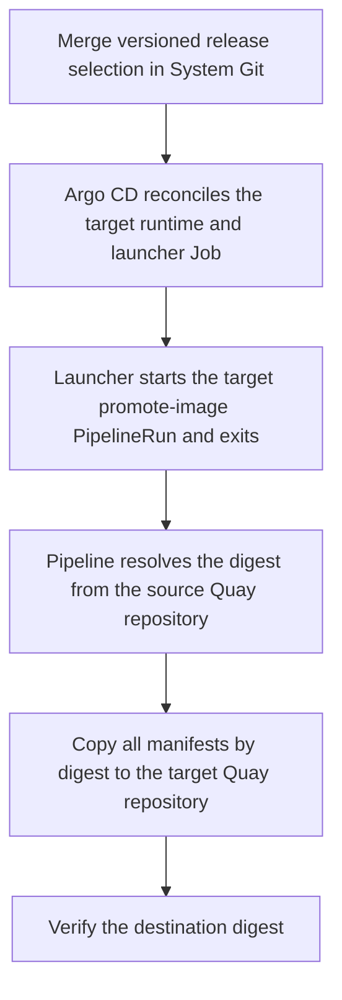

# Architecture

The developer charts translate reviewed tenant Git state into OpenShift resources. The design keeps
tenant intent, platform policy, and runtime reconciliation separate.

## Why the implementation is centralized

The charts are a policy layer, not just a collection of reusable YAML. They answer questions
that tenant intent should not answer independently: which Task implementations are trusted, where
images live, how credentials move between namespaces, which operators implement Resources, and
how Argo CD ownership is divided.

Centralizing those answers gives platform engineers one tested place to evolve implementation and
gives tenants a smaller, safer desired-state vocabulary. The charts accept tenant configuration,
but platform entrypoints supply the trusted repository, revision, Registry, build policy, and
infrastructure coordinates.

The consequence is intentional platform opinion. A tenant can choose among supported profiles and
configure exposed values, but cannot substitute an arbitrary implementation source through its
System repository.

## Design rationale

| Decision | Rationale |
| --- | --- |
| Reconcile from Git without writing back | Tenant Git is the declared state, so charts and controllers only read it and report status through Argo CD, Tekton, and workload conditions. Avoiding controller-generated commits prevents feedback loops and preserves a clear distinction between requested state and observed state. |
| Discover intent with layered ApplicationSets | Domain, System, and leaf layers mirror the catalog concepts and ownership model already presented in Backstage. Small discovery files let Argo CD create only the Applications implied by tenant intent, without a central process regenerating a large manifest. Their paths and presence are consequently treated as a stable, tested interface. |
| Keep trusted implementation coordinates in platform values | Tenants can select supported profiles and configure exposed behavior, but the platform supplies the chart repository and revision. This prevents tenant state from redirecting Argo CD to arbitrary implementation code. Adding a new Resource implementation is therefore an intentional platform change with its own chart, schema, and compatibility tests. |
| Use one Application per Component environment | The environment declaration creates the OpenJDK Application and its ImageStream immediately. Its optional release file adds `image.tag`; workload and promotion resources render only after that selection, so registry provisioning still converges before a release without requiring a second Application. |
| Build once and materialize releases from the built digest | The build environment produces `git-<sha>`, and a human Git tag resolves that commit before copying the existing image to a release tag. This avoids a release-time rebuild and preserves the link to the built commit. The current Maven step uses `-DskipTests`, and release materialization does not guard an existing human image tag; test execution and tag immutability therefore require separate policy. |
| Use environment-local repositories and adjacent promotion | Each runtime pulls from its own environment's Quay repository, keeping credentials local and making image transport an explicit event. The next environment receives narrowly scoped access to the immediately preceding source credential, which limits credential reach and makes the promotion path traceable. Direct skipping and reverse copying are intentionally excluded; rollback selects an older release and follows the same forward path. |
| Assign each shared AppProject one owner | One parent Domain Application owns the Domain project. System projects remain owned by their build-environment controller. |
| Use retained Sync hooks for initial publication and build | The first API publication and Component build must affect Argo CD readiness, so hook Jobs start the PipelineRun, follow its result, and fail the sync when necessary. Successful named Jobs are retained to prevent an ordinary resync from repeating unchanged work; failed hooks are removed so a later sync can retry after correction. |

## Control flow



The Domain chart is evaluated once per Domain and emits one System-discovery ApplicationSet per
ordered environment. Every System environment discovers Component environments and Resources.
Each Component Application optionally consumes its matching release file. API publication is
discovered only by the build-environment System Application.

## Discovery signals

| Level | Discovery pattern | Scope | Result |
| --- | --- | --- | --- |
| Domain | `systems/*/environments/<environment>.yaml` | Selected environment | One active System Application |
| System | `apis/*/values.yaml` | Build environment only | One OpenAPI publication Application |
| System | `components/*/environments/<environment>.yaml` | Selected environment | One OpenJDK Component Application |
| Values | Optional `components/*/releases/<environment>.yaml` | Selected environment | Image selection merged into that Component Application |
| System | `resources/*/*/environments/<environment>.yaml` | Selected environment | One Resource implementation Application |

The environment file is the discovery signal. The OpenJDK chart creates its ImageStream without a
release; selecting a release adds workload and, outside the build environment, promotion resources
without changing the Application boundary.

## Values flow and ownership



| Value class | Owner | Examples |
| --- | --- | --- |
| Tenant identity | Domain catalog entity | SCM host, tenant organization, Domain repository |
| Lifecycle | Domain catalog entity | Environment order, build environment, namespace suffixes |
| Platform integration | Platform target values | Argo CD namespace, router domain, chart repository, Quay, Schema Registry, build policy |
| System intent | System repository | APIs, Component configuration and releases, Resources |
| Implementation | Developer charts | Templates, Tasks, RBAC, workloads, Resource profiles |

The Domain chart normalizes the platform chart clone URL once and passes it through
`delivery.charts`. Child charts never reconstruct that URL from tenant identity. Resource
declarations can select a supported implementation path but cannot replace the platform repository
or revision.

The Domain chart synthesizes `environment.clusterDomain` for the existing System contract from the
target-owned router domain. `build.sccClusterRoleName` is carried through but not consumed by a leaf
template. Routes use OpenShift-assigned hosts, and SCC
authorization remains an external platform responsibility.

## Environment lifecycle

Environment names are not built into the charts. The Domain supplies an ordered lifecycle:

```yaml
spec:
  environments:
    order: [dev, test, prod]
    build: dev
    definitions:
      dev:
        namespaceSuffix: -dev
      test:
        namespaceSuffix: -test
      prod:
        namespaceSuffix: ""
```

The build environment must be first. Source builds happen only there; image promotion moves to the
immediately following environment.



The charts render no direct dev-to-prod path and no reverse copy for rollback. Rollback selects an
older release tag and promotes it through the same adjacent path.

## Argo CD project ownership

| AppProject | Contains | Created by |
| --- | --- | --- |
| `tenant-<domain>-admission` | One parent Domain Application | Platform admission directory |
| `tenant-<domain>` | System controller Applications | Parent Domain Application |
| `tenant-<domain>-<system>` | API, Component, and Resource leaf Applications | System build-environment Application |

The parent Domain Application creates its derived AppProject at sync wave 0. Discovery
ApplicationSets render at wave 1. System projects retain their existing build-environment ownership.
The current projects are organizational and permissive; authorization hardening is separate.

## API publication

The API chart installs one Pipeline with a shared validation and publication path:



An Argo CD Sync hook invokes the Pipeline for the initial revision. EventListener webhooks handle
later main pushes and release tags. The Pipeline uses the curated `tekton-tasks/maven` Task with
Java 21 and the API repository's official Apicurio Maven plugin configuration. Spectral is the
only validation gate; the Pipeline contains no inline `yq` fallback or custom Registry client.

Main publication is idempotent through `FIND_OR_CREATE_VERSION`. A human tag publishes or resolves
the SHA first, then creates the human Registry version with `CREATE_VERSION`.

## Component build and release

Build resources render only when Component values set `build.enabled: true` and the selected
environment matches `build.environment`.



The release branch never packages source, rebuilds an image, updates `latest`, or restarts the
runtime. It performs a single copy attempt and can replace an existing human image tag. Configure
Quay tag immutability or enforce an equivalent release policy before treating the tag as immutable.

The initial build is an Argo CD Sync hook Job. It follows the PipelineRun with `tkn` and fails the
sync if the build fails. A successful Job is retained so ordinary syncs do not rebuild unchanged
source.

## Image promotion

Every active environment owns a distinct Quay repository. A non-build release renders a runtime and
a deterministic launcher Job in the target namespace.



The next environment's promoter can read only the named Quay credential in the preceding namespace.
It writes authentication to ephemeral storage, never copies the Kubernetes Secret, refuses a
conflicting target tag, and treats an already-matching digest as success.

The Deployment and PipelineRun converge independently. Temporary `ImagePullBackOff` is expected
until the target-local image exists.

## Resource implementations

Tenant state selects a supported profile and implementation path:

```yaml
profile: postgresql
implementation:
  path: charts/resource/postgresql
```

The System chart injects the trusted platform repository and revision. The current PostgreSQL
profile layers common and environment values into one Crunchy `PostgresCluster`.

## Related documentation

- [Platform requirements](platform-requirements.md)
- [Operations and troubleshooting](operations.md)
- [Development and testing](development.md)
- In the companion `software-templates` repository: `docs/architecture.md`
